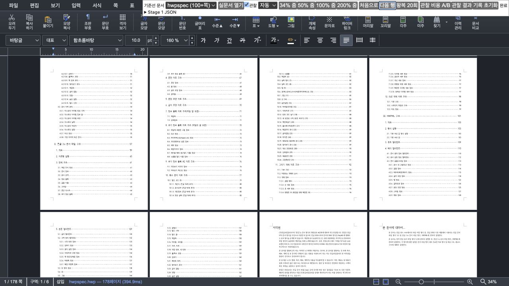

# Studio 스크롤·줌 개발 측정 패널

페이지가 많은 문서에서 새 구간 표시, 같은 구간 왕복, 정착 후 화질과 Canvas 재사용을 조사하는 개발
도구다. 문서·배치·줌을 반복 조작하고 이미 존재하는 렌더 경계를 관찰한다. 제품의 예산·화질 정책을
설정하는 UI나 일반 사용자를 위한 기능은 아니다.

구현은 [`page-scroll-probe.ts`](../../rhwp-studio/src/dev/page-scroll-probe.ts), 지표 계약과 테스트는
[`scroll-observation.ts`](../../rhwp-studio/src/dev/scroll-observation.ts),
[`scroll-observation.test.ts`](../../rhwp-studio/tests/scroll-observation.test.ts)를 따른다. 내부
CanvasView/LRU/scheduler에 의존하므로 다른 애플리케이션에 그대로 붙이는 독립 라이브러리는 아니다.

## 시작하기

1. [개발 환경 가이드](dev_environment_guide.md)에 따라 현재 checkout과 맞는 WASM, Studio 의존성과
   폰트를 준비한다. 다른 checkout의 WASM이나 `--no-opt` 빌드와 최적화 배포판을 섞어 성능을 비교하지 않는다.
2. 저장소 루트에서 개발 서버를 실행한다. 예시 포트가 사용 중이면 다른 포트를 선택한다.

   ```bash
   npm --prefix rhwp-studio run dev -- --host 127.0.0.1 --port 4198 --strictPort
   ```

3. [Canvas2D 측정 URL](http://127.0.0.1:4198/?renderer=canvas2d&scrollProbe=1)을 연다.
   `renderer=canvaskit`도 사용할 수 있다. 실제 선택된 backend를 별도로 확인하고 기록한다.
4. 오른쪽 위 **기준선 문서 → 실문서 열기**를 누르고 `완료`를 기다린다. 선택지는 `exam_kor`,
   `hwpspec`, `kps-ai`, `KTX 4-layer`, 4쪽 실문서, 21쪽 다중 레이어다. 파일은 저장소 `samples/`에서
   불러오며 없으면 임의의 대체 파일로 측정하지 말고 환경을 먼저 복구한다.

[`main.ts`](../../rhwp-studio/src/main.ts)의 `import.meta.env.DEV`와 `scrollProbe=1`이 모두 있어야
패널이 설치된다. production build/preview/배포 확장에는 URL을 붙여도 나타나지 않는다. DEV에서도
옵션 없이 열면 설치되지 않는다. 끄려면 쿼리를 제거하고 다시 로드한다.

아래는 과거 측정 중 패널이 보이는 예시다. 현재 성능이나 화질의 기준 이미지는 아니다.



## 조작과 결과 저장

| 조작 | 실제 동작과 주의점 |
| --- | --- |
| 배치 / 34·50·100·200% 줌 | 기존 page-view 설정과 smooth zoom 경로 사용. `네 열`은 4열·2행 설정이며 자동 배치와 다르다. |
| 처음으로 / 다음 행 | 문서 시작 또는 현재 쪽 높이+gap만큼 세로 이동한다. |
| 왕복 20회 | 시작 위치를 맞춘 뒤 두 위치를 **총 20번 이동**한다. 20개의 왕복 쌍이 아니다. 각 이동의 알려진 작업이 두 프레임 연속 안정될 때까지 기다린다. |
| 관찰 비용 A/B | 같은 제품에서 **계측 on/off** 비용을 비교한다. 제품 수정 전/후 비교가 아니다. 12라운드마다 on/off 순서를 번갈아 수행하며 첫 2라운드는 warm-up으로 집계에서 제외한다. |
| 관찰 결과 | 현재 DOM/surface/queue와 최근 trace의 snapshot을 JSON으로 표시한다. 명시적 snapshot은 DOM bounds도 읽으므로 시간 표본과 분리한다. |
| 기록 초기화 | trace/error/long-task 기록을 비운다. 문서를 다시 로드하거나 LRU·브라우저 cache를 비우지는 않는다. |

`왕복 20회`와 `관찰 비용 A/B`가 끝나면 `Stage 1 JSON` 영역에 결과가 표시된다. 이는 남아 있는 UI
이름이며 현재 구현 전체의 관찰 결과다. **자동 파일 저장/다운로드 버튼은 없다.** JSON 전체를 복사해
UTF-8 `.json` 파일로 저장한다. 일괄 결과를 저장하기 전에 `관찰 결과`를 누르면 `samples`가 있는
일괄 결과 대신 현재 snapshot으로 바뀌므로 먼저 복사한다.

시간 표본 수집 중에는 화면 크기·줌·편집 focus를 바꾸거나 다른 패널 버튼을 누르지 않는다. 스크린샷,
DevTools profiling, DOM snapshot은 별도 반복에서 수집한다. 관찰을 켠 채 wheel·PageUp/PageDown을
직접 조작할 수도 있지만 빠른 연속 입력은 기존 trace를 interrupt하므로 개별 제스처 전체 시간으로
해석하지 않는다. 패널의 프로그램 이동은 실제 scroll/rAF 경로를 쓰지만 wheel 관성까지 재현하지 않는다.

## 무엇을 측정하는가

시간 단위는 ms다. 동일 이름이라도 제품 revision에서 완료 정의가 바뀌었는지 먼저 확인한다.

| 필드/지표 | 의미 | 의미하지 않는 것 |
| --- | --- | --- |
| `samples[].syncMs` | scroll setter가 반환하기까지의 동기 시간 | 전체 렌더 완료 시간 |
| `knownWorkNextFrameMs` | runner가 아는 작업과 두 프레임 안정 대기 완료 | compositor 표시 완료/모든 decoder 완료 |
| `preview` | geometry·ruler 줌 값이 일치한 관찰 경계 | 모든 visible 쪽의 선명한 raster 완료 |
| `visibleFirst` / `visibleStable` | 첫 visible / visible 집합의 알려진 bitmap 준비 | 이후 정착 DPR 승격까지 완료했다는 보장 |
| `focusedSharp` | visible 편집 쪽의 관찰 가능한 이미지 완료까지 확인 | 비가시 focus의 완료 시간; 관찰 근거가 없으면 값이 없을 수 있다. |
| `retainedComplete` | 실제 materialized retained와 scheduler의 알려진 작업 완료 | 후보로만 남은 모든 쪽의 강제 raster |
| `counters` / `traces[].frames` | 호출 횟수·inclusive 시간 / 관찰 rAF 간격 | 중첩 시간을 합한 CPU 총시간 / 실제 dropped frame 수 |
| `longTasks` | 지원 브라우저의 Long Tasks 관찰 기록 | 모든 브라우저에서 동일하게 얻는 지표 |
| `pages[].surfaces`, `activePixels`, `detachedCache` | 실제 backing 크기와 추적 중인 cache·예약 비용 | 프로세스 RSS나 GPU 총메모리; pixels×4는 RGBA 단순 환산일 뿐이다. |

관찰 기록은 bounded buffer다. 장시간 조작 결과를 무한 보존하지 않으므로 작은 시나리오별로 저장한다.
`timeout`, `interrupted`, 이미지 실패, 남은 queue는 누락된 표본이 아니라 별도로 보고할 결과다. 임의로
버린 뒤 성공 표본만 비교하지 않는다. `관찰` off는 wrapper를 복원하지만 같은 runner/이벤트 구독을
사용하므로 패널이 아예 없는 production과 동등하다는 뜻도 아니다.

## 다른 변경에서 재사용하는 방법

1. before/after exact SHA와 계측 adapter revision, fixture SHA-256, 실제 backend, browser/OS/장치,
   viewport CSS px, 실제 DPR, zoom·배치, WASM/JS/lock/font hash와 빌드 옵션을 함께 기록한다.
   기존 [환경 기록](../working/assets/issue6042/environment.json)은 형식 예시이며 새 실행의 환경이 아니다.
2. 같은 조건의 별도 서버에서 A/B 순서를 번갈아 반복한다. cold 새 구간, warm 동일 구간 왕복,
   fully-warm 전체 로드 후 왕복을 구분한다. 패널의 `왕복 20회` 버튼 하나가 이 세 조건을 자동으로
   분리하는 것은 아니다. cold는 각 반복의 문서/cache 초기화 조건과 목적지를 명시한다.
3. p50/p95·표본 수·raster/cache·queue/error·physical pixels를 함께 본다. 첫 표시가 빨라도 최종
   화질 회복은 늦을 수 있다. 정착 후 화질은 별도 스크린샷/실제 DPR로 확인한다.
4. 회귀 경보선과 warm-up 제외 규칙은 결과를 보기 전에 정한다. #6042의 수치나 임계값을 다른 장치의
   절대 합격선으로 복사하지 않는다. 비교되는 양쪽에 동일한 계측 계약이 없으면 먼저 그 한계를 밝힌다.
5. PR에는 방법·환경·대표 A/B의 모든 반복·재집계 명령·불리한 결과를 포함한 요약을 남긴다. 폐기
   표본과 중간 smoke 전체를 계속 누적할 필요는 없다. 이번 PR의 선택 예시는
   [최소 증거 색인](../working/assets/issue6042/README.md)을 따른다.

패널은 원인 분리용 도구이며 사용자 조작, 브라우저 profiling과
[시각 검증 정책](verification/visual_verification_governance.md)을 대체하지 않는다.
