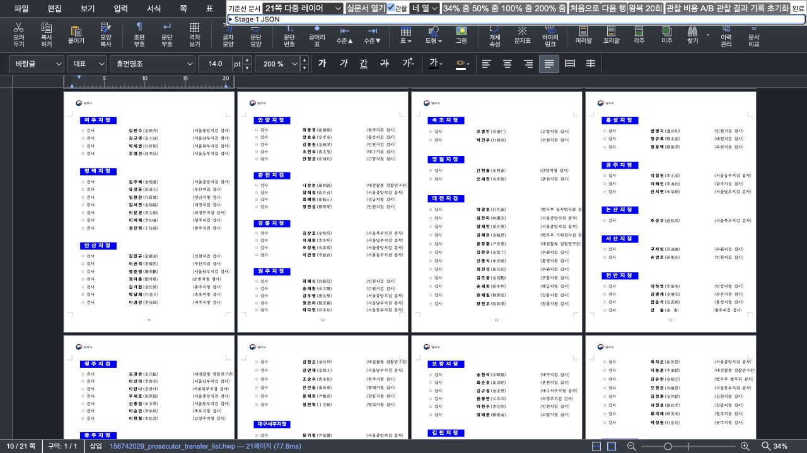
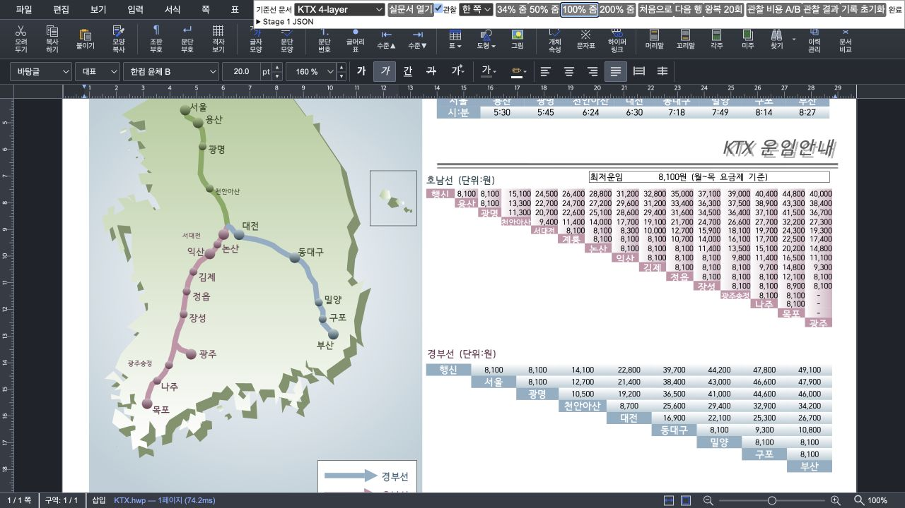

# Task M100 #6042 Stage 3 — 페이지 표면 LRU와 retained pixel 원장

- Issue: [#6042](https://github.com/edwardkim/rhwp/issues/6042)
- 완료: 2026-09-02 13:44 KST
- 상태: **Stage 3 구현·검증 완료, Stage 4 미착수**
- 직접 base: #6467 `23b5bcf73f6e8659a90b25ebfde1311e1965364f`
- Stage 3 시작점: `b6c6850cd96c59d1da9b640e7117247a23053e97`
- 계획: [수행](../plans/task_m100_6042.md), [구현](../plans/task_m100_6042_impl.md)

## 1. 구현 범위

동일 문서 revision·renderer decision·page geometry·backend/profile·정확한 render scale·layer 수가 같은
완성 surface만 재사용하는 `PageSurfaceLru`를 추가했다. entry는 main Canvas와
background/behind/front/flow-static 또는 DOM flow-image layer를 한 bundle로 소유한다. active Canvas를
LRU와 익명 `CanvasPool`에 동시에 넣지 않으며, cache hit에서는 bundle의 원래 DOM 순서를 보존해 다시
붙이고 page raster를 호출하지 않는다.

예산은 #6467의 retained 40,000,000 physical pixel을 그대로 쓴다. active와 승인된 pending 예상량을
먼저 예약한 뒤 남는 headroom에만 detached bundle을 보존한다. `reserved + cached` 누적 원장을 O(1)로
갱신하고 실제 victim 수만큼만 퇴거한다. mandatory 비용만으로 초과하면 cache를 비우되 DPR·render scale을
더 낮추지 않고 `overBudgetMandatory`로 드러낸다.

생성 전 예약은 `PageInfo`와 실제 layer tree의 소수 정밀도 차이를 안전하게 흡수하도록 각 축에 1px을
더한 상한을 쓴다. 렌더 뒤에는 main과 모든 Canvas overlay의 실제 정수 `width×height` 합으로 즉시
reconcile한다. 실제 KTX에서 `PageInfo` 기반 예상 폭 2245와 WASM 반환 폭 2246의 차이를 발견해,
cache entry key에도 실제 surface 종류와 `2246×1588` 같은 정수 shape를 포함하도록 보정했다.

문서 교체/reload, mutation·undo·redo, renderer decision, header/footer margin mode, zoom/resize 전체 release,
reset/dispose에서는 cache를 보수적으로 무효화한다. 순수 scroll은 key에 넣지 않는다. 이미지 decode 또는
RawSvg 재렌더 작업이 남았거나 DOM image가 완료되지 않은 page는 incomplete로 보고 cache에 넣지 않는다.
퇴거된 Canvas는 backing store를 0×0으로 비우고 익명 pool은 최대 4개만 남긴다.

이번 단계에서는 scroll scheduler, visible 작업 분할, idle prefetch 정책, DPR·zoom·page arrangement,
ruler/caret/selection 좌표, Rust/WASM을 변경하지 않았다.

## 2. 실행 기반 정확성 검증

- 순수 LRU 테스트는 exact key와 별도 lookup alias, MRU touch/oldest eviction, 예약·reconcile,
  mandatory 초과, page 무효화·clear, 0 pixel 거부를 검증한다.
- 실제 `CanvasView` prototype과 fake renderer/pool/DOM을 실행하는 통합 테스트는 main+overlay bundle의
  detach/attach, 실제 pixel 합, warm hit raster 0, revision miss의 cold render, incomplete 거부를 검증한다.
- `CanvasPool.adopt/detach/releaseDetached`는 같은 page의 중복 active 소유권과 pool/LRU 이중 소유를
  명시적으로 거부한다.
- DEV probe는 `cache.take/put`을 trace하고 active, detached LRU, 0-size idle pool을 중복 없이 합산한다.

## 3. 실제 문서 20회 왕복

Canvas2D, Chromium 151, 1280×720 CSS px, DPR 2, 고정 4열·34%에서 같은 두 working set을 20회
왕복했다. 첫 interaction은 cold/부분 cold로 분리하고, 이후 19회만 warm-hit 결과로 해석한다.
원문은 [178쪽 JSON](assets/issue6042-stage3/hwpspec-178p-warm-scroll.json)과
[21쪽 다층 JSON](assets/issue6042-stage3/multi-layer-21p-warm-scroll.json)에 보존했다.

| 실제 문서 | warm 19회 main raster | warm 19회 WASM layer raster | visible-stable 중앙값 | update 중앙값 |
| --- | ---: | ---: | ---: | ---: |
| `samples/hwpspec.hwp` 178쪽 | **0** | **0** | 17.0ms | 0.7ms |
| 21쪽 다층 문서 | **0** | **0** | 16.7ms | 0.6ms |

178쪽 최종 snapshot은 active 7,838,640px + detached 7,013,520px = 14,852,160px,
cache 16 entries, 누적 hit 228, eviction 0, pending image/prefetch 0이었다. 21쪽 다층 문서는
active 13,201,920px + detached 4,125,600px = 17,327,520px, cache 5 entries, 누적 hit 317,
eviction 0, pending 0이었다. 둘 다 retained 40M 이하이고 `overBudgetMandatory=false`였다.

첫 interaction은 hwpspec main/layer raster 12/12와 visible-stable 260.3ms, 다층 문서는 1/4와
42.2ms였다. 이는 cache가 아직 채워지는 cold 비용이며 개선 표본에 섞지 않았다. 현재 Stage 3 자료는
동일 배율 warm 왕복의 **구조적 raster 제거**를 입증한다. 현재 parent를 별도 서버에서 교대 측정하지
않았으므로 end-to-end 시간 개선률이나 compositor frame 개선률은 주장하지 않는다.

CanvasKit에서도 4쪽 실문서를 한 쪽·100%로 준비한 뒤 같은 왕복을 20회 실행했다.
[원문 JSON](assets/issue6042-stage3/canvaskit-4p-warm-scroll.json)의 20 interaction 모두 main/layer raster 0,
누적 cache hit 20, warning/error·long task 0이었다. 최종 active Canvas의 exact key가
`backend:canvaskit`, 실제 surface가 `1588×2245`임도 별도로 확인했다. 이는 CanvasKit bitmap을
detach/reattach하는 수명 smoke이며 backend 간 성능 우위를 주장하는 자료는 아니다.

## 4. 다층·시각·실제 pixel 검증

[surface snapshot](assets/issue6042-stage3/multi-layer-21p-surface-snapshot.json)에서 active 16쪽 각각은
`540×764` main과 같은 크기의 front layer 한 장을 유지했다. 20회 왕복 뒤에도 누락, main-only 표시,
잘못된 page ownership, console warning/error가 없었다.

[KTX snapshot](assets/issue6042-stage3/ktx-4layer-100pct-surface-snapshot.json)은 main/background/behind/front
네 장이 모두 `2246×1588`이고 실제 합이 **14,266,592px**임을 기록한다. reserved ledger도 실제 합으로
맞춰졌으며 표시 순서는 background → behind → main → front였다. screenshot은 compositor 표시 확인용이고
픽셀 화질 개선률 근거로 사용하지 않는다. 이 단계는 DPR과 render scale을 바꾸지 않았다.

## 5. 검증 게이트

- 전체 Studio: **1,397 tests / 1,396 pass / 1 skip / 0 fail**
- `npx tsc --noEmit`: 통과
- `npm run build`: 통과, 248 modules. 기존 CanvasKit `fs/path` externalization과 large chunk 경고만 기록
- `npm run e2e:manifest-check`: tracked 125 / manifest 125, 통과
- `git diff --check`: 통과
- 실제 브라우저: Canvas2D hwpspec 178쪽·21쪽 다층 각 20회, KTX 4-layer 100%; CanvasKit 4쪽
  20회. console warning/error 0
- Rust source/test/fixture 변경 없음. Rust lint bundle 대상이 아니다.

## 6. 한계와 다음 승인

DOM에서 제거하거나 Canvas backing store를 0×0으로 만든 사실은 GPU/RSS가 즉시 반환됐다는 증거가 아니다.
원장은 Canvas RGBA physical pixel 환산이며 decoded image cache, WASM heap, 브라우저 compositor surface를
포함하지 않는다. 또한 cache 밖으로 이동하거나 revision/backend/zoom이 바뀌면 정확한 miss와 재래스터가
정상이다.

Stage 3 수용 기준인 exact complete bundle, 단일 소유권, 실제 pixel 예산, 동일 배율 warm 왕복 raster 0,
다층/문서 수명 경계를 충족했다. 다음 승인 대상은 **Stage 4: 일반 scroll visible 작업의 우선순위·시간
분할과 bounded idle prefetch scheduler**다. 승인 전 Stage 4를 구현하지 않으며, #6042 branch push·Draft PR
생성, 하단 PR Ready/merge도 하지 않는다.
