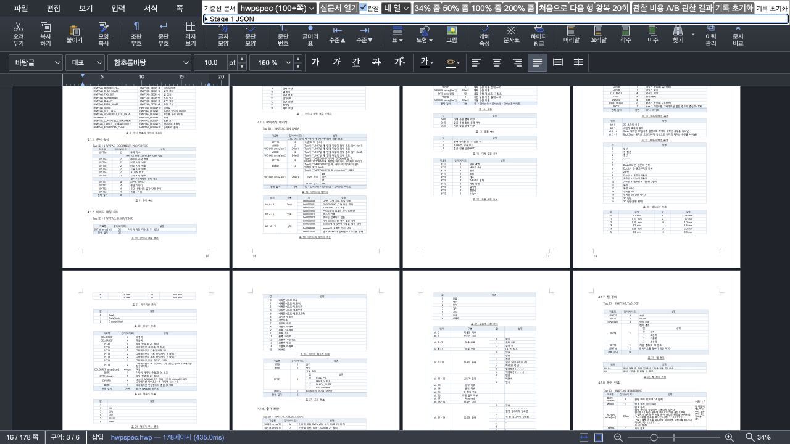

# Task M100 #6042 Stage 4 — scroll visible scheduler와 bounded prefetch

- Issue: [#6042](https://github.com/edwardkim/rhwp/issues/6042)
- 완료: 2026-09-02 14:10 KST
- 상태: **Stage 4 구현·검증 완료, Stage 5 승인 대기**
- 직접 base: #6467 `23b5bcf73f6e8659a90b25ebfde1311e1965364f`
- Stage 4 시작점: `5f5d60071bb403b361e796e6d229d2d5b5a9ebef`
- 계획: [수행](../plans/task_m100_6042.md), [구현](../plans/task_m100_6042_impl.md)

## 1. 구현 범위

`CanvasView.updateVisiblePages`에 `scroll | initial | zoom-settled | resize | mutation | strict` 사유를
명시했다. 일반 `scroll`만 새 scheduler에 연결하고, 초기 표시·줌 정착·resize·편집/문서 변경·strict
document-agent 경로는 visible 전체를 응답 전에 그리는 기존 동기 의미를 유지했다.

scroll에서는 현재 surface budget을 먼저 계산하되 DPR 때문에 key가 바뀐 active 쪽을 즉시 다시 그리지
않는다. 새 visible과 같은 page별 작업으로 합쳐 dispatch 직전 현재 generation·desired set·정확한 raster
key를 다시 확인한다. tier 진단명만 바뀌고 실제 clamped render scale이 같으면 raster하지 않는다.

새 `PageRenderScheduler`는 host의 monotonic clock, rAF/cancel, idle/cancel, timeout을 주입받는다. page별
Map으로 중복을 없애고 다음 순서를 적용한다.

1. 현재 visible focused 쪽
2. viewport 중심과 나머지 visible
3. 기존 ±1행/인접 page 안의 진행 방향 prefetch

1·2개 visible 작업은 기존처럼 동기 fast path로 처리한다. 그보다 많으면 rAF에서 page 경계 기준 4ms
soft budget, slice당 최대 2개를 적용한다. page 내부 WASM raster는 선점하지 못하므로 한 쪽이 4ms를
넘으면 그 쪽을 마친 뒤 양보한다. idle/timeout callback은 매번 prefetch 한 쪽만 처리한다. 새 scroll은
큐를 최신 generation으로 교체하되 이미 예약한 frame은 작업이 남아 있으면 재사용한다.

scroll delta와 monotonic time으로 방향·속도를 상수 시간에 요약한다. 속도는 overscan을 늘리지 않고
진행 반대편 후보의 priority만 낮춘다. zoom/resize/mutation/reset/dispose/backend fallback은 scheduler를
취소하고 새 동기 경계로 들어간다. 기존 `PageRenderer`의 document generation·job token과 Stage 3 bundle
lease/incomplete-cache 거부는 그대로 유지했다.

exact LRU hit는 raster queue에 넣지 않고 현재 retained working set에 즉시 재부착한다. 실제 방향 반전
검증 중 visible은 정상인데 LRU의 retained 쪽을 재부착하지 않아 완료 판정만 timeout되는 결함을 발견했고,
retained 전체 exact hit를 먼저 복구하도록 수정한 뒤 실행 테스트와 실문서 재검증을 추가했다.

## 2. 결정론적 검증

fake host/clock 순수 테스트와 실제 `CanvasView` prototype 실행 테스트 12개가 다음 계약을 고정한다.

- 많은 visible의 focused/중심 우선순위, 4ms soft budget과 page 경계 양보, slice 최대 2개
- 1·2 visible 동기 fast path, initial 열 수 무관 동기 완료
- visible 대기 중 prefetch 금지, idle deadline 부족 시 양보, idle/timeout당 한 쪽
- 새 generation의 기존 rAF 재사용, page 중복 제거, 최신 key로 교체, stale key 기각
- fast path 완료 뒤 남은 빈 frame 회수, `cancelAll`의 frame/idle 소유권 회수
- 방향 반전 시 후보 집합 불변·진행 방향 우선, 낡은 focused surface도 최우선
- exact retained LRU hit 선재부착과 raster queue 제외

기존 소스 구조 테스트는 삭제하지 않고 새 호출 사유와 통합 scheduler 계약을 검사하도록 갱신했다.
focused/current-page/ruler, zoom anchor, surface budget, renderer 회귀군을 포함한 전체 Studio 테스트도
통과했다.

## 3. 실제 문서 스크롤 검증

### 3.1 178쪽 Canvas2D cold jump

Chromium 151, Canvas2D, 1280×720 CSS px, DPR 2, 고정 4열·34%에서 `samples/hwpspec.hwp`를
0px에서 2420px로 한 번 이동했다. 원문은
[JSON](assets/issue6042-stage4/hwpspec-178p-cold-jump.json)에 보존했다.

| 경계 | 결과 |
| --- | ---: |
| `visibility.update` | 31.5ms — 이 안에는 raster가 없고 budget refresh 30.5ms가 대부분 |
| 첫 visible 완료 기회 | 67.6ms |
| visible 8쪽 완료 | 232.4ms |
| retained 16쪽 완료 | 434.1ms |
| visible scheduler 실행 | 8쪽 / 8 slices |
| 이후 prefetch | 8쪽 / idle마다 1쪽 |
| 최종 queue / pending image / error / long task | 0 / 0 / 0 / 0 |

Stage 3의 같은 fixture 첫 cold interaction은 `visibility.update` 안에서 main raster 12회를 동기로 수행해
240.2ms가 걸렸다. Stage 4 표본은 이동 궤적과 raster 수가 달라 시간 개선률로 비교하지 않는다. 다만 이번
trace는 16회의 raster가 update 반환 뒤 visible rAF와 bounded idle로 분리됐다는 구조를 입증한다.

### 3.2 빠른 방향 반전

같은 178쪽 조건에서 `-1800 → +900 → -450px` 입력을 대기 없이 연속 수행했다.
[원문](assets/issue6042-stage4/hwpspec-178p-direction-reversal.json)에서 앞의 두 trace는
`superseded/new-interaction`, 마지막 trace는 `complete`다. 마지막 visible/retained 완료는 모두
147.2ms였고 최종 visible/prefetch queue, frame/idle 예약, pending image가 모두 0이었다. 오류와 long task도
없었다. 이 검증에서 발견한 retained LRU timeout은 수정 전 자료를 덮어쓰지 않고, 수정 후 complete 자료만
증적으로 채택했다.

### 3.3 다층·작은 문서·CanvasKit

- [21쪽 다층 cold jump](assets/issue6042-stage4/multi-layer-21p-cold-jump.json): Canvas2D,
  672×863, DPR 2, 4열·34%. visible 9쪽을 9 slices로 처리했고 `visibility.update`는 8.8ms,
  visible/retained 완료는 280.9ms였다. 완료된 retained 13쪽 모두 main+front 두 layer를 보존했고 image
  재렌더 9회 뒤 pending/error/long task가 0이었다.
- [4쪽 zoom/scroll](assets/issue6042-stage4/four-page-zoom-scroll.json): Canvas2D, 한 쪽 보기에서
  50→100% 줌은 각각 preview 뒤 focused/visible/retained 완료를 기록했다. 이어진 한 행 scroll은 exact
  visible을 37.3ms에 유지했고 새 인접 한 쪽만 idle prefetch했다. scheduler visible 분할 누계는 늘지 않았다.
- [CanvasKit 4쪽 scroll](assets/issue6042-stage4/canvaskit-four-page-scroll.json): 한 쪽·100%에서
  update 0.3ms, visible/retained 27.9ms, queue/pending/error/long task 0이었다. 이 smoke는 backend 수명
  보존 근거이며 backend 성능 우위를 주장하지 않는다.

## 4. 검증 게이트

- scheduler + `CanvasView` 집중 실행: **12/12 통과**
- 전체 Studio: **1,409 tests / 1,408 pass / 1 skip / 0 fail**
- `npx tsc --noEmit`: 통과
- `npm run build`: 통과. 기존 CanvasKit `fs/path` externalization과 large chunk 경고만 기록
- `npm run e2e:manifest-check`: tracked 125 / manifest 125, 통과
- `git diff --check`: 통과
- 실제 브라우저: Canvas2D 178쪽 cold/방향 반전, 21쪽 다층, 4쪽 zoom/scroll; CanvasKit 4쪽 scroll.
  console warning/error 0
- Rust source/test/fixture 변경 없음. Rust lint bundle 대상이 아니다.

## 5. 한계와 다음 승인

4ms는 page 경계의 실험적 soft budget이다. 실제 178쪽 raster 한 쪽은 16.7~31.6ms, 다층 한 쪽은
최대 21.3ms가 걸려 scheduler만으로 한 쪽 long frame을 쪼갤 수 없다. 또한 178쪽 cold update의
30.5ms는 surface budget refresh가 차지해 raster 분리 뒤의 다음 병목으로 남았다. PerformanceObserver의
50ms long task가 0이었다는 사실을 compositor frame 무손실로 해석하지 않는다.

Stage 4는 입력 callback에서 많은 raster를 분리하고 진행성·취소·완료 계약을 입증한 단계다. 최종 UX
수용이나 성능 개선률은 아직 주장하지 않는다. Stage 5에서 현재 parent와 before를 같은 조건으로 최소
20회 A/B·B/A 교대 측정하고, DPR 1/2·auto/horizontal·resize·edit/undo/redo·image failure/fallback·화질·좌표
회귀와 사용자 조작을 검증해야 한다. Stage 5 승인 전 추가 제품 변경, branch push, Draft PR 생성,
하단 stack Ready/merge는 하지 않는다.
