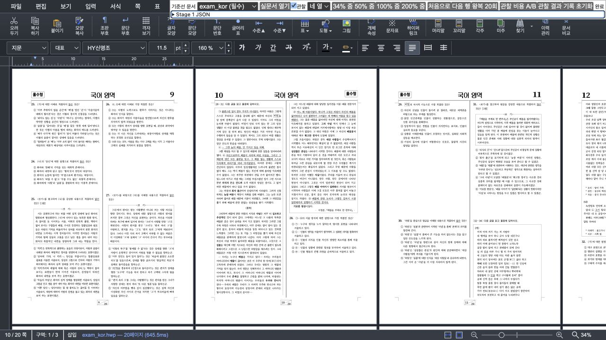
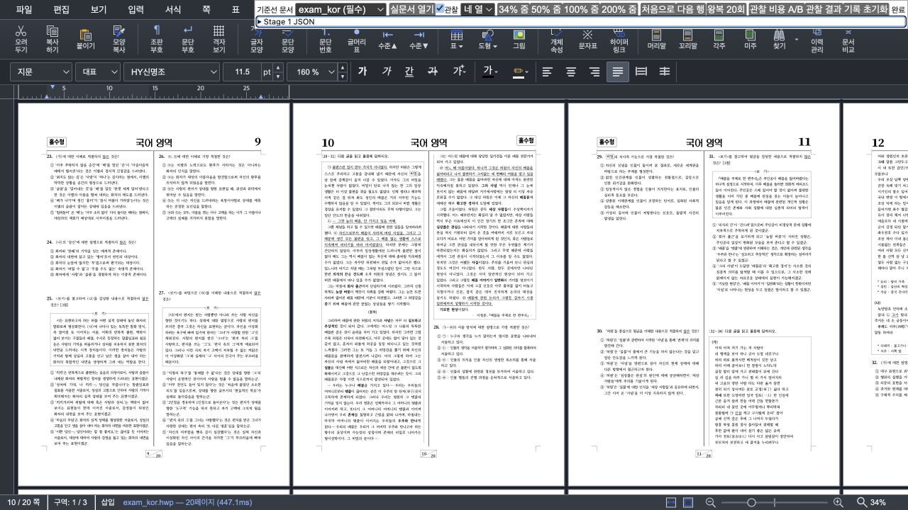

# Task M100 #6042 Stage 4 보정 — retained 전환과 선택 prefetch 분리

- Issue: [#6042](https://github.com/edwardkim/rhwp/issues/6042)
- 검증일: 2026-09-02 KST
- 상태: **보정 구현·재수용 조건 통과, Stage 5 확장 matrix 미완료**
- 기준선: Stage 3 `5f5d60071f7975b99bb0bec03ef20c14597aff04`
- 실패한 Stage 4: `6f2d82d24`
- 보정: `63d29e68b`
- 계획: [수행](../plans/task_m100_6042.md), [구현](../plans/task_m100_6042_impl.md)
- 실패 근거: [Stage 5 중단 보고](task_m100_6042_stage5.md)
- 집계 정본: [summary.json](assets/issue6042-stage5-correction/summary.json)

## 1. 판정

Stage 4가 만든 `exam_kor.hwp` 역방향 cache thrash를 제거했다. Stage 3과 보정을 A1→B1→B2→A2로
교차 측정한 결과, 역방향 main raster p50/p95는 양쪽 모두 **3/3회**이고 cache take는 **4/4회**다.
실패한 Stage 4의 5회 raster가 기준선 수준으로 복구됐다.

역방향 `retainedComplete`는 Stage 3 221.2/233.6ms에서 보정 225.4/238.2ms로 4.2/4.6ms
(1.9/2.0%) 증가했다. 결과 확인 전에 고정한 경보선 p50 `max(10ms, 5%)`, p95
`max(25ms, 10%)` 안이다. 40개 표본/revision은 모두 완료됐고 오류는 없다. 따라서 **발견한 회귀에
대한 Stage 4 보정은 수용**한다.

이 판정은 Stage 5 전체 통과가 아니다. 실제 DPR 1, CanvasKit, 자동 열 경계, 가로 이동, resize,
빠른 연속 반전, 편집·이미지 수명, 1·2쪽 줌 fast path와 사용자 조작 검증은 남아 있다.

## 2. 원인과 최소 보정

실패 원인은 active 쪽의 DPR 축소를 task로 미루면서도 detached exact bundle의 admission은 즉시
확정한 순서 차이다. active 쪽에는 아직 큰 이전 surface가 붙어 있어, 곧 생길 target headroom보다
먼저 exact bundle을 LRU에서 퇴거했다. 이후 역방향 이동이 그 쪽을 다시 raster했다.

보정은 좌표·화질·DPR planner·줌 경로를 바꾸지 않고 다음에 한정했다.

1. 작업을 `visible`, `retained-transition`, `prefetch`로 구분했다.
2. active stale surface는 이전 actual 크기가 아니라 target descriptor 크기로 mandatory 예약한다.
3. 아직 active surface가 없는 선택 prefetch만 별도 예약하며, mandatory 예약과 한 bundle 비용이
   pixel budget에 들어갈 때만 승인한다.
4. prefetch는 dispatch 직전 실제 ledger를 다시 확인하고, 효용이 사라졌으면 실행 없이 취소한다.
5. active DPR 전환은 speculative prefetch와 달리 다음 idle 기회를 기다리지 않는다. 한 task에 한 쪽만
   처리하는 0ms task 경계로 이어 입력 기회와 진행성을 함께 보존한다.
6. generation 취소·문서 경계·실행 완료에서 pending 예약을 해제하고 actual surface로 ledger를
   reconcile한다.

## 3. 테스트 우선 증거

제품 코드를 바꾸기 전에 다음 회귀 테스트를 추가했고 예상대로 실패하는 것을 확인했다.

- active stale surface를 target DPR 비용으로 예약: 15,000px 기대에 이전 actual 60,000px가 계산됨.
- missing prefetch admission/dispatch gate: API와 거절 진단이 없어 실패.
- active target transition의 task-boundary 진행: idle 대기 때문에 완료가 지연됨.

구현 뒤 관련 scheduler·CanvasView 테스트 41개가 통과했다. 실행 테스트는 target 예약, reclaimable LRU가
있는 정상 prefetch, 예산 변경 뒤 dispatch 재검사, 방향 반전, exact cache 복귀와 active transition
진행을 함께 고정한다.

## 4. `exam_kor.hwp` 교차 A/B

- Chromium 151, Canvas2D, viewport 1280×720 CSS px, 실제 DPR 2
- 고정 4열·34%, 같은 두 행 사이 warm 왕복
- A1→B1→B2→A2, block당 20회, revision당 40회

| 지표 | Stage 3 p50 / p95 | 보정 p50 / p95 | 판정 |
| --- | ---: | ---: | --- |
| 전체 retained 완료 | 215.9 / 234.6ms | 216.9 / 238.2ms | 경보선 이내 |
| 전체 첫 visible | 156.0 / 167.1ms | 73.2 / 84.1ms | 개선 유지 |
| 역방향 retained 완료 | 221.2 / 233.6ms | 225.4 / 238.2ms | +4.2 / +4.6ms, 통과 |
| 역방향 main raster | 3 / 3회 | 3 / 3회 | exact 복귀 |
| 역방향 cache take | 4 / 4회 | 4 / 4회 | 동등 |
| 역방향 visibility update | 146.3 / 154.0ms | 0.4 / 0.7ms | callback 분할 유지 |

최종 원장은 두 revision 모두 active/reserved/total **39,090,060px**, detached cache 0,
`overBudgetMandatory=false`다. 보정 scheduler는 세션 누적 기준 선택 prefetch 3건을 admission에서
거절했고 queue와 예약은 완료 후 0이다.

## 5. 178쪽 `hwpspec.hwp` warm 비회귀

같은 환경과 교차 순서로 revision당 40회 측정했다. 모두 완료됐고 오류는 없다.

| 지표 | Stage 3 p50 / p95 | 보정 p50 / p95 |
| --- | ---: | ---: |
| 첫 visible | 16.9 / 17.7ms | 16.6 / 17.7ms |
| retained 완료 | 16.9 / 17.7ms | 16.6 / 17.7ms |
| main raster | 0 / 0회 | 0 / 0회 |
| cache take | 12 / 12회 | 12 / 12회 |

최종 원장은 양쪽 모두 active 7,838,640px + cache 7,013,520px = 14,852,160px이며 예산 안이다.
이 warm 결과는 보정이 LRU hit 경로를 깨지 않았다는 근거다. Stage 5 중단 보고의 cold 개선 수치는
보정 전 Stage 4에서 수집한 것이므로, 보정 후 cold matrix는 Stage 5 재개 때 다시 측정한다.

## 6. 시각·surface 동등성

같은 scroll 좌표에서 Stage 3과 보정의 페이지 배치가 같다.

[기계 비교](assets/issue6042-stage5-correction/exam-4col-34-visual-comparison.json)는 1280×720 중
744px(0.0807%) 차이를 보고한다. footer의 load time과 probe 상태 문구가 포함된 browser JPEG 비교이므로
glyph 화질의 정량 근거로 사용하지 않는다. 대신 [DOM·surface snapshot](assets/issue6042-stage5-correction/exam-4col-34-visual-snapshots.json)의
viewport, zoom, columns, scroll, visible/retained 집합, page box, DPR, scale, layer surface 정수 크기와
active physical pixel을 정규화해 비교했고 모두 동일하다(`coordinatesAndSurfacesEqual=true`).

## 7. 전체 로컬 게이트

보정 커밋 상태에서 다음을 다시 실행했다.

- `npm test`: 1,413개 중 1,412 통과, 1개 스킵, 실패 0
- `npm run build`: TypeScript + Vite production build 통과
- `npm run e2e:manifest-check`: tracked E2E 125개 / manifest 125개, 이상 없음
- `summarize.mjs`, `compare-visuals.mjs`, JSON parse, `git diff --check`: 통과
- Rust source/test/fixture 변경 없음. Rust lint bundle 대상이 아니다.

Vite의 CanvasKit `fs`/`path` externalization과 500kB chunk 경고는 기존 경고이며 build 실패가 아니다.

## 8. 증거 목록과 다음 경계

- 집계기·정본: [summarize.mjs](assets/issue6042-stage5-correction/summarize.mjs),
  [summary.json](assets/issue6042-stage5-correction/summary.json)
- `exam_kor` raw: `exam-4col-34-{stage3-a1,stage3-a2,corrected-b1,corrected-b2}.json`
- `hwpspec` raw: `hwpspec-4col-34-{stage3-a1,stage3-a2,corrected-b1,corrected-b2}.json`
- 화면 비교: [비교기](assets/issue6042-stage5-correction/compare-visuals.mjs),
  [판정](assets/issue6042-stage5-correction/exam-4col-34-visual-comparison.json),
  [차분](assets/issue6042-stage5-correction/exam-4col-34-diff.png)

원시 JSON은 localhost URL·fixture 경로·browser 정보·bounded trace만 담고 계정·토큰·개인 문서는
포함하지 않는다. 다음 단계는 별도 승인 뒤 남은 Stage 5 matrix를 재개하는 것이다. 이 보정 보고만으로
Stage 6 제출 준비, push, PR 생성 또는 Ready 전환을 수행하지 않는다.
