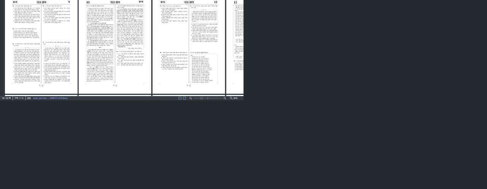

# Task M100 #6042 Stage 5 — A/B 검증 중 발견한 역방향 retained 회귀

- Issue: [#6042](https://github.com/edwardkim/rhwp/issues/6042)
- 측정일: 2026-09-02 KST
- 상태: **Stage 5 중단·Stage 4 보정 계획 재승인 대기**
- before: Stage 3 `5f5d60071f7975b99bb0bec03ef20c14597aff04`
- after: Stage 4 `6f2d82d24`
- 계획: [수행](../plans/task_m100_6042.md), [구현](../plans/task_m100_6042_impl.md)
- 집계 정본: [summary.json](assets/issue6042-stage5/summary.json)

## 1. 판정

Stage 4 scheduler는 178쪽 단층 문서의 cold jump에서 입력 callback과 첫 visible 표시를 크게 줄였다.
그러나 20쪽 다층 문서의 역방향 복귀에서 exact detached bundle 두 쪽을 먼저 잃고 다시 raster해,
`retainedComplete` p95가 **221.9ms → 310.1ms(+39.7%)**, 역방향만 보면
**227.8ms → 310.5ms(+36.3%)**로 악화됐다. 측정 전에 고정한 경보선
`p95: max(25ms, 10%)`를 넘는다.

따라서 현재 Stage 4를 수용하지 않는다. 나머지 Stage 5 matrix와 사용자 승인, Stage 6 제출 준비로
넘어가지 않고 아래 보정 설계를 계획서에 반영했다. 이번 단계에서 제품 코드는 더 수정하지 않았다.

## 2. 조건과 방법

- 브라우저: Chromium 151, Canvas2D
- viewport: 1280×720 CSS px, 실제 DPR 2
- 서버: Stage 3 `127.0.0.1:4191`, Stage 4 `127.0.0.1:4193`
- 주 스크롤: 고정 4열·34%, 시작 상태 안정화 뒤 두 행 사이 왕복
- 반복: warm block은 A1→B1→B2→A2, 각 block 20회로 revision당 40회
- 178쪽 cold는 매 표본 문서를 다시 열고 첫 이동 trace만 채택, 짝수 A/B·홀수 B/A로 20쌍
- 줌 회귀는 4쪽 실문서의 한 쪽/두 쪽 보기에서 50↔100%를 revision당 각 40회 수행
- 완료 계약은 `visibleFirst`, `visibleStable`, `retainedComplete`를 구분한다. rAF 간격을 compositor
  dropped frame으로 부르지 않았다.
- 경보선은 결과 확인 전에 p50 `max(10ms, 5%)`, p95 `max(25ms, 10%)`로 고정했다.

시간 계측과 screenshot은 분리했다. in-app browser가 반환하는 화면 캡처는 JPEG이므로 화질의 정량
근거로 쓰지 않고 페이지 배치·공백·누락 검사에만 썼다. 화질 정책 비변경은 같은 DPR, integer surface
크기, physical pixel 수와 줌 trace로 별도 확인했다.

## 3. 178쪽 `hwpspec.hwp` — 의도한 개선

4열·34% cold jump 20쌍은 모두 완료됐고 error가 없었다.

| 지표 | Stage 3 p50 / p95 | Stage 4 p50 / p95 | 변화 |
| --- | ---: | ---: | ---: |
| known work next frame | 390.3 / 400.7ms | 352.2 / 360.2ms | -9.8% / -10.1% |
| 첫 visible | 271.2 / 278.9ms | 56.5 / 59.0ms | **-79.2% / -78.8%** |
| visible 전체 안정 | 271.2 / 278.9ms | 250.9 / 259.7ms | -7.5% / -6.9% |
| retained 전체 완료 | 377.0 / 396.3ms | 351.6 / 359.7ms | -6.7% / -9.2% |
| `visibility.update` | 243.8 / 247.7ms | 19.1 / 19.6ms | **-92.2% / -92.1%** |
| main raster 호출 | 12 / 12 | 12 / 12 | 동일 |

Stage 4는 같은 12쪽 raster를 callback 밖의 page slice로 옮겼다. long task는 Stage 3의 40개·합계
6,887ms에서 Stage 4의 0개로 줄었다. 한 쪽 raster 자체가 선점 가능한 작업으로 바뀐 것은 아니므로,
이 결과를 모든 문서의 frame 무손실로 일반화하지 않는다.

같은 탭의 warm 40회에서는 revision 모두 p50 25.0ms이고, Stage 4 p95가 26.5ms로 Stage 3의
37.2ms보다 낮았다. 대부분 exact surface가 이미 있어 main raster 평균은 표본당 0.6회였다. 최종
physical pixel은 둘 다 14,852,160px(active 7,838,640px + detached 7,013,520px)로 동일하다.

## 4. 20쪽 다층 `exam_kor.hwp` — 수용 불가 회귀

### 4.1 전체 40회

| 지표 | Stage 3 p50 / p95 | Stage 4 p50 / p95 | 판정 |
| --- | ---: | ---: | --- |
| known work next frame | 164.3 / 222.4ms | 157.6 / **311.0ms** | p95 +39.8%, 실패 |
| 첫 visible | 152.9 / 158.2ms | 55.3 / 69.2ms | 개선 |
| visible 전체 안정 | 152.9 / 158.2ms | 55.3 / 150.7ms | 비회귀 |
| retained 전체 완료 | 158.2 / 221.9ms | 151.7 / **310.1ms** | p95 +39.7%, 실패 |
| main raster 호출 | 2 / 3 | 2 / **5** | 역방향 추가 작업 |
| main raster 시간 | 148.3 / 205.5ms | 143.0 / **280.8ms** | p95 악화 |

오류·미완료 표본은 없지만 완료가 늦어진다는 사실은 그대로 회귀다. PerformanceObserver long task는
Stage 3 60개·6,966ms, Stage 4 98개·6,423ms다. page별 callback으로 나뉘어 개수는 늘고 합계는 조금
줄었으므로 어느 한 숫자만 개선으로 제시하지 않는다.

### 4.2 방향 분리

| 방향 | 지표 | Stage 3 p50 / p95 | Stage 4 p50 / p95 | 변화 |
| --- | --- | ---: | ---: | ---: |
| 아래 | retained 완료 | 152.8 / 157.0ms | 146.0 / 151.0ms | 비회귀 |
| 아래 | raster 호출 | 2 / 2 | 2 / 2 | 동일 |
| 위 | retained 완료 | 218.4 / 227.8ms | **294.7 / 310.5ms** | **+34.9% / +36.3%** |
| 위 | raster 호출 | 3 / 3 | **5 / 5** | 두 쪽 증가 |

대표 역방향 trace에서 Stage 3은 18·19쪽 DPR 갱신 뒤 4쪽만 새로 그리고 5·6·7쪽 exact cache hit를
사용했다. Stage 4는 7쪽만 cache hit였고 6·5·4쪽을 다시 그린 뒤 19·18쪽도 갱신했다.

```text
Stage 3: raster 18 → 19 → 4; cache hit 5 → 6 → 7
Stage 4: cache hit 7; raster 6 → 5 → 4 → 19 → 18
```

최종 active physical pixel은 둘 다 39,090,060px이고 detached cache는 0이다. 다만 Stage 4 원장은
아직 그리지 않은 후보까지 41,256,000px로 예약해 `overBudgetMandatory=true`가 됐다. 이 상태에서
선택 prefetch를 계속 수행하면 결과를 오래 보존하지 못하는 raster가 될 수 있다.

### 4.3 원인

Stage 3은 surface plan 갱신 중 18·19쪽의 낮아진 target DPR을 동기로 반영한 뒤, 화면 밖 4~7쪽
bundle을 LRU에 넣었다. 그래서 작아진 actual surface를 기준으로 5~7쪽을 보존할 여유가 있었다.

Stage 4는 DPR 변경을 입력 callback 밖으로 미루면서 순서를 바꿨다. 18·19쪽에는 아직 더 큰 이전
surface가 붙어 있는 시점에 4~7쪽을 detach·admit하고 즉시 trim한다. 곧 수행될 downscale이 여유를
만들기 전에 4~6쪽이 비가역적으로 퇴거되고, 다음 역방향 입력에서 5·6쪽을 다시 그리게 된다. 즉 원인은
page slice 자체가 아니라 **target 상태가 아직 반영되지 않은 잠깐의 actual ledger로 cache admission을
확정한 것**이다. 여기에 retained budget을 넘는 선택 prefetch를 dispatch 전에 거르는 gate도 없다.

## 5. 4쪽 실문서 줌 비회귀

`samples/21868765_별표2_보건소_분장사무.hwp`에서 50↔100%를 arrangement별·revision별 40회
측정했다. 각 zoom에는 20개 표본이 있다.

| 보기·배율 | 지표 | Stage 3 p50 / p95 | Stage 4 p50 / p95 |
| --- | --- | ---: | ---: |
| 한 쪽 50% | preview | 14.5 / 15.3ms | 15.0 / 15.4ms |
| 한 쪽 50% | focused/visible | 127.8 / 132.7ms | 124.8 / 127.5ms |
| 한 쪽 100% | preview | 14.8 / 15.3ms | 15.1 / 15.5ms |
| 한 쪽 100% | focused/visible | 129.1 / 133.4ms | 124.5 / 128.3ms |
| 두 쪽 50% | preview | 14.9 / 15.8ms | 14.8 / 15.2ms |
| 두 쪽 50% | focused/visible | 144.8 / 149.2ms | 140.5 / 144.1ms |
| 두 쪽 100% | preview | 14.8 / 15.3ms | 14.9 / 15.8ms |
| 두 쪽 100% | focused/visible | 144.2 / 149.6ms | 140.4 / 143.7ms |

모든 표본이 complete이고 error는 0이다. raster 호출과 final physical pixel도 revision 간 동일하다.
한 쪽 50/100%는 2회·1,783,324/7,133,296px, 두 쪽은 4회·3,566,648/14,266,592px다.
preview의 최대 +0.5ms 차이는 고정한 10ms 경보선보다 작다. 이 Stage가 줌 정책을 바꾸지 않았고
1·2 visible 동기 fast path를 보존했다는 회귀 근거이지, 줌 성능 개선 주장에는 쓰지 않는다.

## 6. 시각·surface 동등성

같은 4열·34%·scroll 좌표의 compositor 화면은 문서 배치와 쪽 내용이 육안상 같다.




23/640,000px(0.0036%) 차이는 하단의 문서 로드 시간 숫자다. [차분](assets/issue6042-stage5/exam-4col-34-diff.png)과
[기계 판정](assets/issue6042-stage5/exam-4col-34-visual-comparison.json)에 보존했다. JPEG source이므로 이
수치를 glyph 화질 동등성 주장에 쓰지 않는다.

[DOM·surface snapshot](assets/issue6042-stage5/exam-4col-34-visual-snapshots.json)의 scroll,
visible 12쪽, retained 20쪽, page box, 각 page DPR·scale·main/background/behind/front integer surface,
physical pixel, image 상태와 error 배열은 revision 간 동일하다. `image.scope` 숫자만 탭별 document/view
generation이라 다르고 decoded/cached 상태는 같다.

## 7. 보정 계획과 재수용 조건

Stage 4 보정은 좌표·화질·줌 정책을 건드리지 않고 다음에 한정한다.

1. scroll DPR 전환을 `visible 필수`, `active target-DPR 전환`, `선택 prefetch`로 진단·큐에서 구분한다.
2. content/layer 구성이 같은 active DPR 전환은 이전 큰 actual 값이 아니라 **현재 layer 수 × target의
   clamp된 integer width×height**로 target-state 예약한다. 확대 전환은 필요한 증가분을 allocation 전에
   예약하고, 축소 전환은 완료 직후 actual 값으로 reconcile한다.
3. 같은 update에서 막 detach한 exact bundle은 target-state reconcile이 끝나기 전에 임시 old surface
   크기만 보고 비가역 퇴거하지 않는다. 임시 보류도 ledger에 한 번만 포함하고 새 allocation을 허용하는
   추가 예산으로 취급하지 않는다.
4. 선택 prefetch는 dispatch 직전 actual headroom과 예상 보존 이득을 다시 확인한다.
   `overBudgetMandatory`이거나 완성 bundle 하나도 retained할 수 없으면 raster하지 않는다.
5. 방향 반전은 반대 방향 선택 작업을 취소하며, 같은 exact key를 잃고 다시 그리는 cache thrash가
   없도록 실행 기반 테스트를 추가한다.

보정 후 동일 raw fixture·trajectory로 A/B·B/A 각 20회 이상을 다시 수집한다. `exam_kor` 역방향의
추가 raster 5회를 기준선의 3회 이하로 되돌리고, p50/p95가 고정 경보선을 넘지 않아야 한다. 동시에
`hwpspec` 첫 visible·전체 visible·retained 개선과 1·2쪽 줌 fast path를 다시 통과해야 한다.

## 8. 남은 Stage 5 경계

회귀가 확인된 시점에 계획대로 확장 matrix를 중단했다. 실제 DPR 1, CanvasKit 전체 A/B,
auto 1↔2↔3↔4열 경계, horizontal X, resize, 빠른 연속 반전, PgUp/PgDn·scrollbar, edit/undo/redo,
image failure/fallback의 Stage 5 반복 검증과 사용자 조작 승인은 **아직 완료되지 않았다**. Stage 4에서
수행한 smoke와 결정론적 테스트를 이 미완료 matrix의 대체로 표시하지 않는다.

## 9. 로컬 검증

- scheduler·surface LRU·budget·visibility snapshot·zoom anchor 집중 테스트: **37/37 통과**
- `summarize.mjs` 재집계와 모든 JSON parse: 통과
- `compare-visuals.mjs` 재실행: 1280×500, 23/640,000px 차이
- `git diff --check`: 통과
- Rust source/test/fixture 변경 없음. 이번 중단 보고에서 Rust lint bundle 대상이 아니다.

Stage 4 제품 코드는 이미 전체 Studio 1,409 tests, TypeScript, production build와 manifest gate를
통과했다. 이번 Stage 5는 성능 수용 실패 때문에 그 결과를 다시 전체 실행해 제출 준비로 포장하지 않는다.
보정 구현 뒤 focused와 전체 게이트를 모두 새로 실행한다.

## 10. 증거 목록

- 집계기·정본: [summarize.mjs](assets/issue6042-stage5/summarize.mjs),
  [summary.json](assets/issue6042-stage5/summary.json)
- 178쪽 cold 20쌍: [raw JSON](assets/issue6042-stage5/hwpspec-4col-34-cold-alternating.json)
- 178쪽 warm 40회/revision: `hwpspec-4col-34-{a1,a2,b1,b2}.json`
- 20쪽 다층 40회/revision: `exam-4col-34-{a1,a2,b1,b2}.json`
- 4쪽 줌 40회/revision·보기: `four-page-{single,double}-50-100-{a1,a2,b1,b2}.json`
- 화면 비교: [비교기](assets/issue6042-stage5/compare-visuals.mjs),
  [판정](assets/issue6042-stage5/exam-4col-34-visual-comparison.json),
  [차분](assets/issue6042-stage5/exam-4col-34-diff.png)

원시 JSON은 browser UA·localhost URL·fixture 경로·시간과 bounded trace만 담는다. 계정·개인 문서·토큰은
포함하지 않았다. 이 자료는 실패 조건을 숨기지 않는 로컬 Stage 증거이며 아직 PR 자료로 게시하지 않았다.
