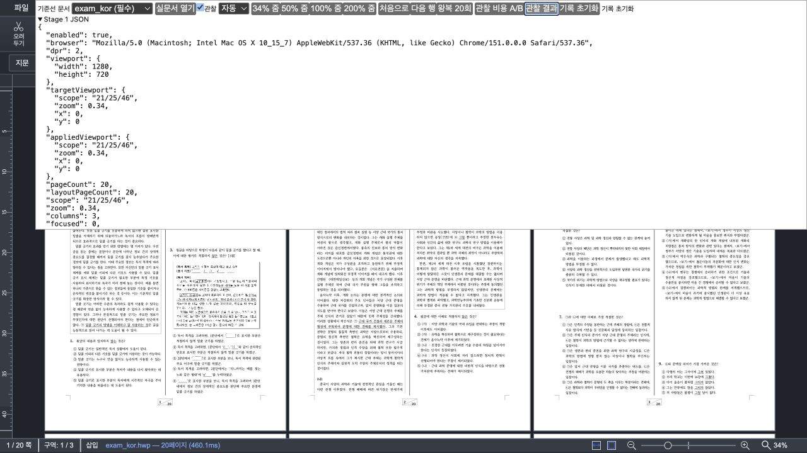
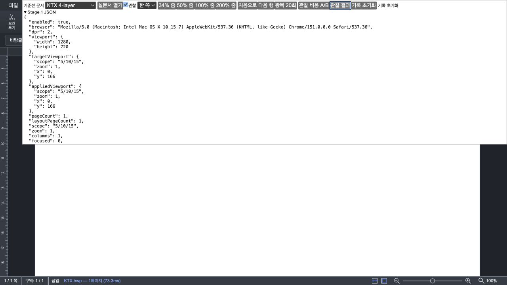

# Task M100 #6042 Stage 5 확장 — 보정 후 자동화 가능 matrix

- Issue: [#6042](https://github.com/edwardkim/rhwp/issues/6042)
- 측정일: 2026-09-02 KST
- 상태: **자동화 가능 matrix 통과 — 잔여 조건은 후속 Stage 5 종료 보고에서 완료**
- before: Stage 3 `5f5d60071bb403b361e796e6d229d2d5b5a9ebef`
- after: Stage 4 보정 `63d29e68b`
- 관찰기 판정 보정: `6c65df255`
- 계획: [수행](../plans/task_m100_6042.md), [구현](../plans/task_m100_6042_impl.md)
- 선행 근거: [Stage 5 실패](task_m100_6042_stage5.md), [Stage 4 보정](task_m100_6042_stage4_correction.md)
- 집계 정본: [summary.json](assets/issue6042-stage5-expanded/summary.json)

## 1. 판정

Stage 4 보정 뒤 자동화 브라우저가 제공하는 범위의 Stage 5 확장 matrix를 통과했다. Canvas2D와
CanvasKit의 성능 표본은 revision당 260개로 모두 `complete`, error 0이며, `retainedComplete`
p50/p95는 결과 확인 전에 고정한 `max(10ms, 5%)` / `max(25ms, 10%)` 경보선 안이다.

자동 1↔2↔3열, 고정 한 쪽·두 쪽·4열, 맞쪽, 세로·가로 이동, 빠른 방향 반전, 34/50/100/200% 줌,
실문서 교체와 편집·undo·redo도 before/after의 visible·retained·surface·page box를 보존했다.
CanvasKit은 surface cache key의 `backend:canvaskit`으로, auto는 양쪽 모두
`backend:canvas2d` 폴백으로 확인했다.

이 보고 시점의 in-app browser는 viewport 1280×720과 실제 DPR 2로 고정돼 실제 DPR 1과 live resize를
만들 수 없었다. browser image failure 주입과 사용자 시각 승인도 당시 남았다. 후속 별도 Chrome 실행과
사용자 직접 조작으로 이 조건을 채운 최종 판정은 [Stage 5 종료 보고](task_m100_6042_stage5_complete.md)를
따른다.

## 2. 조건과 방법

- 브라우저: Chromium 151, viewport 1280×720 CSS px, 실제 DPR 2
- 서버: Stage 3 `127.0.0.1:4191`, Stage 4 보정 `127.0.0.1:4193`
- renderer: Canvas2D, CanvasKit, `auto` 폴백
- 문서: `exam_kor.hwp` 20쪽, `hwpspec.hwp` 178쪽, `kps-ai.hwp` 77쪽,
  `basic/KTX.hwp` 1쪽 4-layer, 4쪽 실문서, 21쪽 다층 실문서
- 성능 반복: 주 조건 A1→B1→B2→A2, block당 20회, revision당 40회. `kps-ai` 보완은 20회
- 성능과 screenshot은 분리. screenshot은 browser JPEG라 배치·누락 근거로만 쓰고 glyph 화질의
  정량 근거로 쓰지 않는다.
- layout 동등성은 page/visible/retained/DPR/render scale/layer surface/physical pixel/page box를
  비교했다. smooth zoom rAF의 좌표 반올림은 반복 측정으로 별도 판정했다.

관찰기는 예산상 후보인 `currentRetainedPages`와 실제 materialize된 retained working set을 구분한다.
보정 scheduler가 200%에서 선택 prefetch를 정당하게 거절해도 없는 surface의 완료를 무한 대기하던
진단 결함을 테스트 우선으로 수정했다. 제품 DPR·geometry·queue·renderer 결과는 바꾸지 않았다.

## 3. 성능 비회귀

아래는 `retainedComplete` p50 / p95다. 모든 표본은 완료·오류 0이다.

| renderer·문서·보기 | Stage 3 | 보정 | 변화·판정 |
| --- | ---: | ---: | --- |
| Canvas2D `exam_kor` 한 쪽 50% | 16.9 / 25.4ms | 16.7 / 17.6ms | -0.2 / -7.8ms, 통과 |
| Canvas2D `exam_kor` 두 쪽 50% | 331.6 / 342.8ms | 346.2 / 362.2ms | +14.6 / +19.4ms, 경보선 이내 |
| Canvas2D `hwpspec` 한 쪽 50% | 16.9 / 17.7ms | 16.7 / 17.6ms | -0.2 / -0.1ms, 통과 |
| Canvas2D `hwpspec` 두 쪽 50% | 16.9 / 17.8ms | 16.7 / 17.7ms | -0.2 / -0.1ms, 통과 |
| CanvasKit `exam_kor` 4열 34% | 16.8 / 17.7ms | 16.7 / 17.4ms | -0.1 / -0.3ms, 통과 |
| CanvasKit `hwpspec` 4열 34% | 16.9 / 17.9ms | 16.6 / 17.1ms | -0.3 / -0.8ms, 통과 |
| Canvas2D `kps-ai` 4열 34% | 16.8 / 17.9ms | 16.7 / 17.5ms | -0.1 / -0.4ms, 통과 |

`exam_kor` 두 쪽은 retained 완료가 4.4% / 5.7% 늦었지만 해소 한도 16.6ms / 34.3ms보다 작은
14.6ms / 19.4ms다. 동시에 첫 visible p50/p95는 123.2/132.1ms에서 63.3/71.2ms로 줄었다.
이 결과는 경보선 안의 비회귀 판정이며, 캐시 온도와 브라우저 부하가 섞인 local 표본을 일반적인
두 배 성능 개선으로 주장하지 않는다.

CanvasKit `exam_kor`·`hwpspec`의 main raster p95는 양쪽 모두 0회, `hwpspec` cache take는
12/12회다. 보정이 CanvasKit exact cache 경로를 깨지 않았다. `kps-ai` 보완 표본도 main raster p95
0회, cache take 12회로 같다.

## 4. 배치·스크롤·줌

### 자동 보기

`exam_kor`의 34→50→100→200→100→50→34% 열 수는 양쪽 모두
`3→2→1→1→1→2→3`이다. visible/retained와 visible page surface·box도 같다.

200%에서는 mandatory visible 하나만으로 surface budget을 넘는다. Stage 3은 화면 밖 retained 후보까지
materialize해 active 135,464,550px였고, 보정은 선택 prefetch를 admission에서 거절해 visible 결과를
유지하면서 114,071,400px만 materialize했다. 차이 21,393,150px은 **비가시 선택 surface를 만들지 않은
것**이며 표시 중인 쪽의 DPR이나 화질 저하가 아니다.

### 가로·대면·마지막 행

- 가로 이동: PageDown 세 번과 PageUp 두 번의 X 위치, visible 3쪽, 최종 Y와 page box가 동등하다.
- 맞쪽: 시작은 0쪽 단독 오른쪽 슬롯, 다음 행은 1·2쪽, 아래 이동 뒤 1·2·3쪽 visible로 동등하다.
- 21쪽 고정 4열: 마지막 행 도달 시 visible 16~20, retained 12~20, scroll Y 1774와 모든 box가 같다.
  마지막 20번 쪽의 현행 왼쪽 슬롯 배치는 Stage 3부터 같은 동작이며 이 PR이 새로 중앙 정렬한 것으로
  주장하지 않는다.
- 빠른 반전: 20쌍 PageDown/PageUp에서 양쪽 모두 `complete 24`, `superseded 16`, 최종 visible
  8~19, retained 4~19, queue 0, error 0이다.

### 줌 좌표 반복성

4쪽 실문서의 한 쪽·두 쪽 50→100→200→100→50%는 surface와 page box가 동등했다. KTX 4-layer
34→50→100→200→100→50→34%를 각 revision에서 두 번 반복했다.

- Stage 3 반복 간 최대 scroll 차이: 1 CSS px
- 보정 반복 간 최대 scroll 차이: 1 CSS px
- 첫 A/B 최대 차이: 2.5 CSS px
- 같은 조건 재반복 A/B 최대 차이: 0.5 CSS px

따라서 2.5px은 보정에서 누적되는 새 좌표 이동이 아니라 smooth zoom rAF·반올림 표본 잡음으로
분류했다. 허용 비교 한도 3px 안이며 두 revision 모두 반복 뒤 34/50%에서 scroll 0으로 돌아왔다.

## 5. 문서·이미지·편집 수명

Canvas2D에서 `exam_kor → KTX 4-layer → hwpspec → 4쪽 실문서 → kps-ai → exam_kor` 순서로
교체했다. 각 문서의 page count, visible/retained/active 집합, DPR·surface, `pendingImages=0`, error 0이
동등했고 document/view scope는 매 교체마다 새 값으로 진행했다.

KTX 4-layer는 Canvas2D와 CanvasKit 각각 34/50/100/200/100/50/34%에서 flow image `ready`,
pending image 0, error 0으로 끝났다. 성공한 이미지·다층 수명은 확인했지만 network/decode failure를
browser에서 강제로 만든 fault-injection은 수행하지 않았다. `imageCompletion('failed')`와
`flowImageState`의 fail-closed 계약은 전체 Node test에 포함돼 있다.

4쪽 실문서에서 한 글자 입력→undo→redo를 수행했다. 각 단계의 content/view scope가 네 개의 서로 다른
값으로 진행했고, visible 0·retained 0~1·surface layout, pending 0, error 0이 양쪽에서 같다. 보정 scheduler의
queue와 frame/idle 예약도 매 단계 0으로 정착했다.

## 6. renderer·surface와 시각 근거

CanvasKit 명시 탭은 surface cache key의 `backend:canvaskit`으로 확인했다. `renderer=auto` 탭은 양쪽
모두 `backend:canvas2d`를 선택했으며 50% 두 쪽의 각 layer integer surface와 physical pixel이 같다.

Canvas2D 자동 34%:

CanvasKit KTX 4-layer 100%:

[기계 비교](assets/issue6042-stage5-expanded/visual-comparison.json)는 각각 546px(0.0592%),
1,802px(0.1955%) 차이를 보고한다. 차분은 대부분 probe JSON의 세대 숫자, ruler와 footer load time이다.
browser JPEG 비교이므로 화질 정량 주장이 아니라 누락·대규모 배치 이동이 없다는 보조 근거다.
동등성의 주 근거는 raw DOM·surface snapshot이다.

## 7. 관찰기 의미 보정

보정 scheduler의 `currentRetainedPages`는 “예산상 시도할 후보”이며 모두 active Canvas를 가져야 하는
완료 집합이 아니다. 특히 200%에서 비가시 후보가 admission 거절되면 surface가 없는 것이 정상이다.
기존 probe는 후보 전부를 `rendered`로 기다려 제품은 정착했는데 진단만 timeout됐다.

`admittedRetainedPages`를 추가해 visible은 항상 완료를 요구하고, retained는 실제 Canvas가
materialize된 working set만 image/flow/retained-complete 대기 대상으로 삼았다. 테스트는 `[4,5,6]`
중 surface가 없는 5를 제외하는 계약을 먼저 실패시킨 뒤 구현했다. 이 변경은 DEV probe 전용이며
제품 렌더링 결정과 사용자가 보는 화면을 바꾸지 않는다.

## 8. 전체 게이트

- `npm test`: 1,414개 중 1,413 통과, 1개 스킵, 실패 0
- `npm run build`: TypeScript + Vite production build 통과
- `npm run e2e:manifest-check`: tracked E2E 125 / manifest 125, 이상 없음
- `summarize.mjs`: 자동화 matrix `accepted=true`
- `compare-visuals.mjs`, 모든 raw JSON parse, `git diff --check`: 통과
- Rust source/test/fixture 변경 없음. Rust lint bundle 대상이 아니다.

Vite의 CanvasKit `fs`/`path` externalization과 500kB chunk 경고는 기존 경고이며 build 실패가 아니다.

## 9. 이 보고 시점에 남았던 Stage 5 종료 조건

1. 실제 DPR 1 환경에서 Canvas2D/auto의 single·double·4열 34/50/100/200% smoke
2. 실제 창 폭을 줄였다 늘리는 동안 auto 열 hysteresis, ruler, scroll 좌표 검증
3. browser 이미지 실패/fallback fault-injection 또는 동등한 실행 기반 수명 증거
4. 사용자의 직접 조작으로 눈금자 지연, 좌우/상하 점프, 빈 쪽·화질 회귀가 없다는 시각 승인

위 네 항목은 [Stage 5 종료 보고](task_m100_6042_stage5_complete.md)에서 모두 확인했다. Stage 6 제출 준비,
push, Draft PR 생성 또는 stack Ready 전환은 여전히 별도 승인 경계다. 현재 4191/4193 서버는
Stage 3/보정 A/B 직접 검증에 사용할 수 있다.

## 10. 증거 목록

- 재집계: [summarize.mjs](assets/issue6042-stage5-expanded/summarize.mjs),
  [summary.json](assets/issue6042-stage5-expanded/summary.json)
- 기능 증적 정규화: [compact-functional-evidence.mjs](assets/issue6042-stage5-expanded/compact-functional-evidence.mjs)
- 화면 비교: [compare-visuals.mjs](assets/issue6042-stage5-expanded/compare-visuals.mjs),
  [visual-comparison.json](assets/issue6042-stage5-expanded/visual-comparison.json), `*-diff.png`
- 성능 raw: Canvas2D `exam`/`hwpspec` single·double, CanvasKit `exam`/`hwpspec` 4열,
  Canvas2D `kps-ai` 4열의 `*.json`
- 기능 raw: auto zoom, horizontal, facing, last row, rapid reverse, fixed zoom, KTX zoom,
  document switch, edit/undo/redo, backend identity의 `*.json`

원시는 localhost URL·fixture 경로·browser 정보·bounded trace만 담는다. 계정·토큰·개인 문서는 포함하지
않았다. 자료는 아직 GitHub에 게시하거나 PR asset으로 이동하지 않았다.
