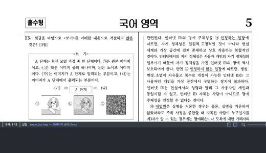
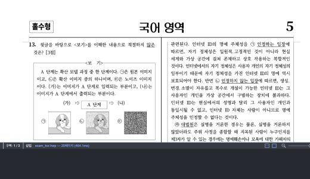

# Task M100 #6042 Stage 5 사용자 화질 보정 — scroll 정착 visible 승격

- Issue: [#6042](https://github.com/edwardkim/rhwp/issues/6042)
- 측정일: 2026-09-02 KST
- 상태: **구현·자동화 A/B·사용자 재검증 통과 — Stage 5 종료 보고로 인계**
- before: Stage 3 `5f5d60071bb403b361e796e6d229d2d5b5a9ebef`, `127.0.0.1:4191`
- after: `a762e58ea`, `127.0.0.1:4193`
- 환경: Chromium 151, viewport 1280×720 CSS px, 실제 DPR 2, Canvas2D
- 계획: [수행](../plans/task_m100_6042.md), [구현](../plans/task_m100_6042_impl.md)
- 피드백: [scroll 정착 전 visible 화질](../feedback/task_m100_6042_stage5_visible_quality.md)
- 집계 정본: [summary.json](assets/issue6042-stage5-scroll-quality/summary.json)

## 1. 판정

스크롤로 새로 보이는 비포커스 쪽이 클릭 전 DPR 1에 머물던 현상은 #6042 scheduler가 만든 회귀가
아니었다. Stage 3 before에서도 같았고, #6467의 32M visible 예산·hysteresis·편집 focus raw 보호가
결합한 결과였다. viewport 쪽을 편집 focus로 바꾸지 않고 **스크롤 중에는 현재 surface를 재사용하고,
마지막 입력 150ms 뒤 visible 쪽의 화질만 별도 승격**하는 보정을 채택했다.

실제 문서 A/B에서 두 쪽 100%의 비포커스 visible은 클릭 없이 DPR 1→2로 회복했다. 편집 focus는
0쪽에 남았고 scroll 위치·열 수·페이지 위치는 바뀌지 않았다. 34% 자동 보기의 기존 DPR 2는 그대로
보존했고, 200%에서는 실제 합산 비용에 따라 DPR 1.5 또는 기존 planner 결과를 선택했다.

이 보정은 성능 최적화가 아니라 정착 뒤 읽기 화질의 복원이다. 입력 callback 시간은 늘지 않았지만
추가 raster만큼 최종 known-work 완료가 늦고 surface 비용도 증가한다. 사용자가 읽는 정착 화면의 화질을
위해 의도적으로 지불하는 비용이며, 64M hard gate로 상한을 둔다.

## 2. 구현 경계

1. active scroll planner는 DOM에 실제로 붙은 surface의 requested DPR을 interaction lock으로 사용한다.
   visibility 변화만으로 DPR을 낮추거나 높이지 않는다.
2. 마지막 scroll 뒤 150ms debounce가 끝나면 양 축 8 CSS px 이상 겹치는 visible 집합을 한 번 계산한다.
3. visible 전체 raw 비용이 64M surface px 이하면 raw DPR, 넘으면 DPR 1.5를 시도하고, 그것도 넘으면
   #6467 planner 결정을 유지한다. 편집 focus는 언제나 기존 raw 보호를 유지한다.
4. 승격은 1·2쪽도 rAF page slice에서 center-first로 수행한다. timer와 scroll callback 안에서 동기
   raster하지 않는다. 새 입력·zoom·resize·mutation·문서/renderer 경계는 대기 작업을 취소한다.
5. target DPR이 바뀌어도 완성 bundle은 Canvas에 기록된 actual key로 보존한다.
6. fractional DPR의 integer physical dimension을 역산하지 않고 main·overlay CSS 크기를
   `PageInfo × zoom`으로 고정한다. 따라서 DPR 교체는 page box·scroll·ruler geometry를 바꾸지 않는다.

#6467의 32M/40M planner·cache 예산, DPR 후보, 출력 profile은 수정하지 않았다. 64M은 정착 visible
mandatory 집합에만 적용하는 hard safety gate이며 cache 용량이 아니다.

## 3. 클릭 없는 실제 화질 A/B

`exam_kor.hwp`, 두 쪽, 100%, focus 0쪽 상태에서 다음 행(2·3쪽)으로 스크롤하고 클릭하지 않았다.
두 서버 모두 scroll `(0, 1597.5)`, visible `[2, 3]`이었다.

| 항목 | Stage 3 before | 보정 after |
| --- | ---: | ---: |
| visible 쪽 DPR | 1, 1 | 2, 2 |
| 쪽당 surface pixel | 5,349,972 | 21,393,150 |
| 편집 focus | 0 | 0 |
| 정착 scheduler | 해당 없음 | queue 0, timer false, error 0 |

수정 전 — 클릭하기 전 DPR 1:

수정 후 — 클릭 없이 DPR 2 정착:

스크린샷은 glyph 화질의 정량 지표가 아니라 같은 viewport에서의 사용자 관찰 근거다. DPR과 physical
surface pixel이 화질 승격의 기계 근거다.

## 4. 정책 경계 실행 확인

| 조건 | before | after | 판정 |
| --- | --- | --- | --- |
| 자동 34%, 3열, 다음 행 | visible 0~8 모두 DPR 2, 30,529,440px | 동일 | 저배율 기존 화질·배치 불변 |
| 200%, 한 쪽, 비포커스 1쪽 visible | DPR 1, 21,393,150px | DPR 1.5, 48,125,352px | raw는 64M 초과, 1.5 수용 |
| 200%, 두 쪽, 비포커스 2·3쪽 visible | DPR 1, 1 | DPR 1, 1 | DPR 1.5 합산도 64M 초과, planner 유지 |

세 조건 모두 focus는 0쪽에 남았고 정착 뒤 queue·frame·idle·timer는 0/false였다. 34% A/B의 scroll Y는
545.5이고 active pixel도 같았다. 200% 두 쪽에서는 보이지 않는 focus 쪽을 viewport focus로 바꾸지 않았다.

## 5. 성능 영향

두 쪽 100%에서 행을 번갈아 20회 이동했다. `syncMs`는 scroll 이벤트 호출 구간이고,
`settledKnownWork`는 probe가 150ms 정착 승격까지 기다린 최종 완료다. 기존 `visibleStable` milestone은
초기 visible bitmap이 준비된 시점이며 뒤의 화질 승격 완료를 의미하지 않으므로 최종 판정에 쓰지 않는다.

| 지표 p50 / p95 | Stage 3 before | 보정 after | 변화 |
| --- | ---: | ---: | ---: |
| scroll callback | 0 / 0.1ms | 0 / 0.1ms | 0 / 0ms |
| 첫 visible bitmap | 124.1 / 134.2ms | 70.5 / 79.2ms | -53.6 / -55.0ms |
| visible bitmap 집합 | 124.1 / 134.2ms | 135.2 / 147.0ms | +11.1 / +12.8ms |
| 정착 포함 known work | 332.3 / 349.4ms | 365.6 / 403.5ms | **+33.3 / +54.1ms** |
| main raster 횟수 | 6 / 6 | 6 / 6 | 동일 |

첫 visible 시간 감소는 page slicing 순서와 cache 상태가 함께 반영된 로컬 결과이므로 성능 개선으로
일반화하지 않는다. 핵심 비회귀 근거는 scroll callback이 동일한 것이고, 핵심 비용은 사용자가 멈춘 뒤
최종 화질 승격 때문에 known work가 p50 33.3ms, p95 54.1ms 늦어진다는 점이다.

최종 표본에서 visible 두 쪽 자체의 surface 비용은 10,699,944→42,786,300px로 늘었다. active 전체는
retained 구성 변화와 #6467 예산 조정을 포함해 38,783,724→53,486,244px(+14,702,520px)였다. 모든
visible을 무조건 DPR 2로 만드는 대신 64M 집합 gate가 200% 두 쪽을 기존 DPR 1에 남기는 이유다.

원시 20회 표본은 [before](assets/issue6042-stage5-scroll-quality/exam-double-100-before-20.json),
[after](assets/issue6042-stage5-scroll-quality/exam-double-100-after-20.json)에 보존했다.

## 6. 회귀 테스트와 전체 게이트

- RED: settle API 부재, active DPR lock 부재, raw/1.5/fallback resolver 부재, actual cache key 부재,
  fractional DPR CSS size 고정 부재를 각각 실패로 확인했다.
- 집중 테스트: 37/37 통과. debounce·재입력/cancelAll 취소, focus raw 보호, active DPR 1/2 lock,
  64M raw/1.5/fallback, center-first 비동기 승격, actual bundle key, CSS geometry를 포함한다.
- `npm test`: 1,422개 중 1,421 통과, 1개 스킵, 실패 0.
- `npm run build`: TypeScript·Vite production build 통과.
- `npm run e2e:manifest-check`: tracked 125 / manifest 125, 이상 없음.
- Rust source/test/fixture 변경 없음. Rust lint bundle 대상이 아니다.

Vite의 CanvasKit `fs`/`path` externalization과 500kB chunk 경고는 기존 경고이며 build 실패가 아니다.

## 7. 사용자 검증과 종료 인계

1. `:4191`과 `:4193`에서 `exam_kor`, 두 쪽, 100%를 열고 cursor가 없는 행으로 스크롤한다.
2. 클릭하지 않은 채 약 0.5초 기다린다. before는 흐린 상태가 남고 after는 정착 뒤 선명해져야 한다.
3. 연속으로 스크롤하는 동안 페이지가 좌우·상하로 움직이지 않고, 멈춘 뒤 화질만 바뀌는지 확인한다.
4. 자동 34%에서 기존 다중 쪽 화질·중앙 배치, 200% 한 쪽/두 쪽에서 메모리 안전 fallback을 확인한다.
5. zoom 중 ruler 즉시 반영, focus/caret/현재 쪽 불변도 함께 확인한다.

사용자는 위 보정을 적용한 현재 서버를 직접 다시 조작한 뒤, 앞서 제보한 스크롤 버벅임이 사라진 것
같다고 보고했다. 실제 DPR 1, 28개 browser viewport resize와 실제 image decode failure/fallback도
후속 실행 검증을 통과했다. 전체 종료 판정과 명령·한계는
[Stage 5 종료 보고](task_m100_6042_stage5_complete.md)를 따른다. Stage 6·push·PR 생성은 별도 경계다.
